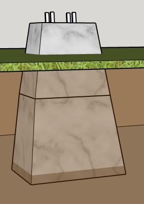

# Tools
* Wheelbarrel, Shovel
* Rebar Cutter
* Pocket Jig for rails

# Materials
## Foundation
* 12"x12"x12" Forms for Concrete Pier Forms
* 9"x9"x12" Forms for Concrete Footers
* Bags of Concrete
* 8' Rebar
* 6 in. x 6 in. Galvanized Post Base - $14
* Post Fasteners

##  Deck
* 2x6x10 PT
* 2x6x8 PT
* Z-MAX 2 in. x 6 in. 18-Gauge Galvanized Concealed Face Mount Joist Hange - $2
* Fasteners

## Frame
* 6x6x10 PT Post
* 4x4x8 PT Post
* 4x4x12 PT Beam
* 4x4x8 PT Rails
* 4x4x2 PT Studs
* Fasteners (No post-to-beam hardware)

## Truss
* 4x4x10 PT Beams
* 4x4x16 PT Beam

## Sheathing
* 4x8 3/4" Deck
* 4x8 3/4" Roof
* Metal Roof
* 8'x100' screen

## Door
* 4"x5/8 boards
* 2x4 studs

# Notes and Calculations
## Foundation
* Footings in Clay with 12" square base support 1500 lbs/sqft
* 8'x20' @ 60lbs exerts 9600 lbs/sqft
* I will pour 6 footings or 1600 lbs/sqft/footing
* Required size is 12.8"
* Tapered footings are 9" on top, (9 + n) / 2 = 12.8, n = 16.6" base
* Depth is 24", Sin(A) = (16.6 - 9) / 2 / 24 = 9.1 degrees (1.9 pitch)
* Volume ((12.8 + 16.6) / 2)^2 * (24 / 12^3) = 3 cubic feet or 360 lbs concrete
* Cost = 360 lbs * $6/120lbs = $18
* Note: 36 hours to cure, 7 days at 70% strength, so build 1st form, pour, build 2nd form, pour, at 18 piers / 2 forms 10 nights to mix and pour and $630 in rebar + concrete + post base
* [forms](../images/footing-pier-forms.PNG)
* 
* TOTAL COST OF FOUNDATION: $650 + 10 nights

## Deck
* Floor joists hang on the pier-to-roof 6x6 support beams.  Which comes first?
* Install temporary beam stubs
* Piers allow 1.5" to support floor joists
* Frame, square and block both decks, fasten to temporary stubs
* One-by-one replace stub with beam, bracing as you go
* [Sheath the floor](../images/floor-sheathing.PNG) with 3/4" ground-contact plywood, positioned to fasten the two decks.
* Install the 6x6 beams on the post bases and get them square with temporary braces
* [Block and fasten](../images/post-to-rim-joist.PNG) the end joists to the posts
* TOTAL COST OF FLOOR: $400 + deck bolts + fasteners

## Frame
* Replace braces with beams,frame doorway
* Unclear how to fasten [truss jacks](../images/truss-jacks.PNG) to wall place